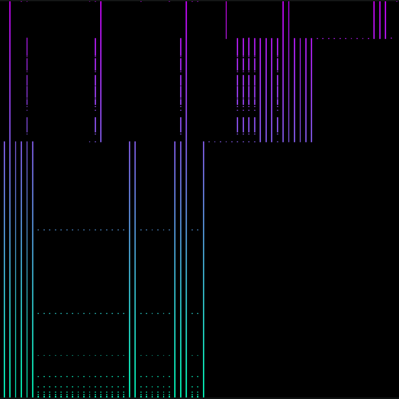

# Program Trace Visualizer
PorgramTraceVisualizer is a multiplatform application that visualizes traces of programs.
| | |
|--|--|
 | 
 | 

## Setup
  * Clone this repository: git clone https://github.com/Krytog/ProgramTraceVisualizer.git
  * Get the submodules: git submodule update
  * Create a build directory: ```mkdir build```
  * Enter it: ```cd build```
  * Generate make files: ```cmake ..```
  * Build ProgramTraceVisualizer target: ```make ProgramTraceVisualizer```

## Dependecies
All the library dependencies will be installed as git submodules. You only have to ensure that
 * you have any suitable for portable-file-dialogs OS file dialog back-end
 * your systems supports OpenGL 3.3.0 or higher

## Trace files
The application reads traces from ```.trace``` files. These files contain program traces as a binary sequence of ```64-bit unsigned``` (```uintptr_t``` in C++) functions addresses. To capture such a trace, you can use your own method or check the option in ```external/coverage```.